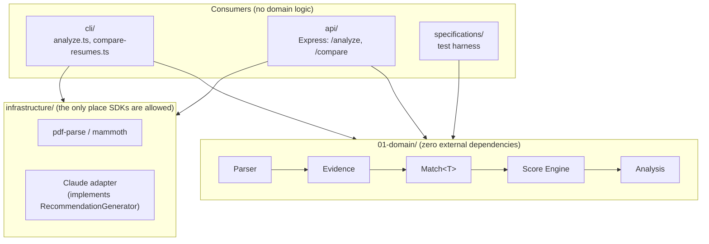

# Resume Copilot

[](https://github.com/T-Hernandez/Resume-Copilot/actions/workflows/ci.yml)
[](LICENSE)

A deterministic ATS-style resume/job matching engine, with an explainable score, a web UI, a REST API, and a CLI - built around one rule: **the backend decides the score, an LLM only ever explains it.**

🔗 **Live demo:** [resume-copilot-kwu2.onrender.com](https://resume-copilot-kwu2.onrender.com) - free tier, sleeps after ~15 min idle, first load may take ~30-50s to wake up.

```
Resume Copilot - Analysis
========================================
Overall score: 53%
Confidence: 52%

Breakdown:

Skills
████░░░░░░ 40
  + React
  - TypeScript (missing)

Experience
███████░░░ 75
  + 1+ years required

Recommendations:
  [high] Add or gain experience with TypeScript - it's a required skill for
         this role that your resume doesn't currently show.
```

## Why deterministic

Most "AI resume matchers" ask an LLM to invent a score. That number isn't reproducible, isn't explainable, and drifts between runs on the exact same input. Resume Copilot's core decision (ADR-001) is the opposite: **parsing, matching, and scoring are 100% deterministic code with zero LLM involvement.** Given the same resume and job text, `overall` is byte-identical every time. An LLM is only ever an *optional* layer on top that rephrases already-decided facts into prose - it can never see raw resume/job text, and it cannot change the score, the gaps, or the weaknesses.

## Architecture



| Layer | Responsibility |
|---|---|
| `01-domain/` | Parser → Evidence → `Match<T>` → Score Engine → `Analysis`. Pure, deterministic, unit-tested, zero external dependencies. |
| `infrastructure/` | The only place external SDKs are allowed: PDF/DOCX extraction (`pdf-parse`, `mammoth`), the Claude adapter (`@anthropic-ai/sdk`) implementing the domain's `RecommendationGenerator` port. |
| `config/` | Shared defaults (e.g. `DEFAULT_PIPELINE_CONFIG`) used by every consumer, so weights live in exactly one place. |
| `cli/` | First consumer of the domain: reads files, calls `generateAnalysis()`, prints the result. |
| `api/` | Second consumer of the domain: an Express REST API over the exact same `generateAnalysis()` call. |
| `public/` | Third consumer, technically a consumer of `api/`: a static, vanilla-JS/HTML/CSS web UI (no framework, no build step) served by the same Express process at `/`. Calls `POST /analyze`/`POST /compare` via `fetch` and renders the response - no domain logic here either. |
| `specifications/` | A small declarative Scenario DSL for domain behavior, plus standalone spec scripts for infrastructure/API/service-layer integration checks. |

Every consumer (CLI, API, the spec harness itself) goes through the same single entry point, `generateAnalysis()` in `01-domain/services/generate-analysis.ts`. Nothing outside `01-domain` computes a score, a match, or a gap.

## Quick start

### Docker (one command)

```bash
docker compose up
```

Starts the API on `http://localhost:3000`. No API key, no setup - the deterministic engine (parsing, matching, scoring, the visual score explanation, and baseline recommendations) needs no credentials at all. Set `ANTHROPIC_API_KEY` in your shell (or a `.env` file, see `.env.example`) only if you also want the optional AI-enhanced recommendations.

### Deploy (Render)

[](https://render.com/deploy?repo=https://github.com/T-Hernandez/Resume-Copilot)

Render builds `Dockerfile` directly - same container as `docker compose up` above, no rewrite. `render.yaml` (a Render Blueprint) already declares the service, the Docker runtime, and `/health` as the health check path. `ANTHROPIC_API_KEY` is optional and prompted for at deploy time (`sync: false` in `render.yaml`), never committed. Free tier note: the service sleeps after ~15 minutes idle and the next request takes ~30-50s to wake it - fine for a portfolio link, not for anything latency-sensitive.

### Local

```bash
npm install
npm run specs           # 0 failed / 68 total
npm run analyze -- examples/resume-sparse.txt examples/job-react-senior.txt
npm run api              # starts the REST API on :3000
```

## CLI

```bash
# Single resume vs. a single job
npm run analyze -- <resume.(txt|pdf|docx)> <job.(txt|pdf|docx)> [--recommend]

# Resume only, no job to compare against - see "What if there's no job posting?" below
npm run analyze -- <resume.(txt|pdf|docx)>

# Rank multiple resumes against one job
npm run compare-resumes -- <job.(txt|pdf|docx)> <resume1> <resume2> [...more]
```

`--recommend` adds an optional AI-enhanced recommendations section (requires `ANTHROPIC_API_KEY`) on top of the deterministic recommendations, which are always printed regardless. It requires a job (there's nothing to recommend *against* without one).

### What if there's no job posting?

A candidate doesn't always have one specific posting to compare against. Omitting the job argument (CLI) or checking "I don't have a specific job posting" (web UI) switches to a different, honest mode: instead of a job-match score, you get what was actually extracted from the resume - skills, experience entries (with total years), education - plus warnings about anything the parser couldn't confidently read. There is deliberately no fabricated score here: a match score means nothing without requirements to measure it against. See [`01-domain/services/analyze-resume.ts`](01-domain/services/analyze-resume.ts).

## Web UI

`GET /` serves `public/index.html` - a form to analyze one resume against one job (with the same bar-chart score breakdown the CLI prints, or the resume-only breakdown above if no job posting is given), and a second tab to compare multiple resumes against one job, ranked. Paste text or upload a `.txt`/`.pdf`/`.docx` file directly in the browser - it's converted client-side and sent to the exact same `POST /analyze`/`POST /analyze-resume`/`POST /compare` endpoints documented below. No separate deployment, no framework, no build step: it's static files served by the same process.

## API

`GET /health` returns a static 200 for health checks - no domain logic, no request body.

`/analyze`, `/analyze-resume`, and `/compare` are all rate-limited (20 requests/minute/IP - each runs a real parsing/scoring pipeline, and `/analyze` with `recommend: true` calls the paid Claude API, so a public deployment needs an abuse ceiling). Security headers (`helmet`) and gzip (`compression`) are applied to every response.

### `POST /analyze`

```bash
curl -X POST http://localhost:3000/analyze \
  -H "Content-Type: application/json" \
  -d '{
    "resume": {"text": "Skills: React\nExperience\nCompany A\nEngineer\n2022 - 2023"},
    "job": {"text": "Required Skills: React, TypeScript\nMinExperienceYears: 1"}
  }'
```

A resume/job can be `{"text": "..."}` or `{"base64": "...", "format": "pdf"|"docx"}` - PDF/DOCX go through the same extractor the CLI uses. Add `"recommend": true` to also get AI-enhanced recommendations (falls back to `recommendationError` on the response if Claude is unreachable or uncredentialed - the deterministic `analysis`/`explanation`/`recommendations` are still returned).

Response: `{ analysis, explanation, recommendations, aiRecommendations?, recommendationError? }`.

### `POST /analyze-resume`

```bash
curl -X POST http://localhost:3000/analyze-resume \
  -H "Content-Type: application/json" \
  -d '{"resume": {"text": "Skills: React\nExperience\nCompany A\nEngineer\n2022 - 2023"}}'
```

The no-job counterpart to `/analyze` - see "What if there's no job posting?" above. A separate endpoint with its own response shape rather than making `job` optional on `/analyze`, since there is no honest `overall`/`explanation`/`recommendations` to return without a job's requirements to measure against.

Response: `{ insight: { resumeId, skills, experience, education, totalExperienceYears, warnings } }`.

### `POST /compare`

```bash
curl -X POST http://localhost:3000/compare \
  -H "Content-Type: application/json" \
  -d '{
    "job": {"text": "Required Skills: React, TypeScript\nMinExperienceYears: 1"},
    "resumes": [
      {"id": "alice", "document": {"text": "Skills: React, TypeScript\n..."}},
      {"id": "bob",   "document": {"text": "Skills: React\n..."}}
    ]
  }'
```

Runs the same `generateAnalysis()` pipeline once per candidate and ranks the results (by `overall`, tiebroken by `confidence`). Response: `{ compared, algorithmVersion, generatedAt, results: [{ rank, id, analysis }] }`. Capped at 50 resumes per request.

## What "deterministic" actually buys you

- **`overall`** - a weighted average (`PipelineConfig.weights`) over per-category subscores, each derived only from `Match<T>` evidence. No fabricated categories, no score-boosting floors.
- **`confidence`** - the real average confidence across every `Match<T>` that was actually produced, or `undefined` (never `0`) when the job stated no requirements at all - "nothing was evaluated" is a different claim from "low confidence."
- **`explanation`** - the same facts as `breakdown`, grouped by category with `matched`/`missing` skill/requirement lists, so a frontend can render bars, rings, or anything else without re-deriving which fact belongs to which category.
- **`recommendations`** - always present, zero-dependency, rule-based (`buildDeterministicRecommendations`). One line per gap or unmet requirement, severity-tagged. No network call.
- **`resumeId`/`jobId`** - a deterministic content hash by default, or a caller-supplied id (e.g. `compare-resumes`'s per-candidate id) when one is given - never a hardcoded placeholder.

## Testing

```bash
npm run specs      # domain scenarios + infrastructure + API + service-layer + frontend specs (68 total)
npm run compare     # diagnostic: the old V1 engine vs. the current V2 engine on 22 real resume/job pairs
```

The domain layer (`01-domain`) is tested through a small declarative Scenario DSL (`given` resume/job text, `expect` dot-path assertions on the resulting analysis - see `specifications/runner/`). Infrastructure (PDF/DOCX extraction against real hand-built fixture files), the API handlers, and the comparison/ranking services each have their own standalone spec scripts, all wired into the one `npm run specs` command. `public/*.js` is covered too (`specifications/public/frontend.spec.ts`): it loads the real `index.html` in `jsdom` with the actual `<script src>` tags executing, so tests exercise the shipped files, not a reimplementation.

## Design decisions

| Decision | Why |
|---|---|
| Scoring is deterministic, never LLM-driven | Reproducibility and explainability - the same resume/job text always produces the same `overall`. An LLM score can't promise that. See [ADR-001](ADR/ADR-001-deterministic-scoring.md). |
| `Match<T>` separates *matched* from *confidence* | "The candidate clearly doesn't meet this requirement" and "we don't have enough data to tell" are different claims and need different signals - collapsing them into one score loses information a reader needs. |
| `confidence` can be `undefined`, never coerced to `0` | A job with no stated requirements has nothing to be confident *about* - that's a different claim from "low confidence," so the type says so instead of picking a misleading number. |
| LLM recommendations only ever see `RecommendationInput` (already-decided facts) | Never the raw resume/job text - structurally prevents the LLM from inventing a skill, a score, or contradicting a fact the deterministic engine already produced. |
| Deterministic recommendations exist independently of the LLM path | So every response is useful with zero API key and zero network access - the LLM path is an opt-in enhancement, not a requirement. |
| `RecommendationGenerator` is a port, implementations are swappable | `ClaudeRecommendationGenerator` (infrastructure, needs an SDK) and the deterministic rule-based generator (domain, needs nothing) both implement the same interface - switching providers doesn't touch a single consumer. |
| `01-domain` has zero external dependencies, not even Node built-ins | Forces every non-trivial decision (id generation included - see `deterministic-id.ts`) to be explicit, portable, and trivially unit-testable without mocks. |

## Design docs

- [ADR-001](ADR/ADR-001-deterministic-scoring.md) - why scoring is deterministic, never LLM-driven.
- [ADR-004](ADR/ADR-004-parsed-document-match-model.md) - the `ParsedResumeDocument`/`ParsedJobDocument`/`Match<T>` model.
- [Ubiquitous-Language.md](Ubiquitous-Language.md) - shared vocabulary across domain and docs.
- `01-domain/README.md` - the one hard rule for that folder: no external dependencies, ever.

## Project status

**Feature-complete for v1.** Engine, CLI, API, a web UI, PDF/DOCX ingestion, multi-candidate comparison, visual score explanation, and deterministic recommendations are built and tested. Docker, CI, Render deployment, and an MIT license are in place. The Claude-based recommendation enhancement is opt-in and needs your own API key.

Deliberately not built (out of scope for this version, not overlooked): persistence/history, authentication/multi-user, a dashboard, and further `Match<T>` categories (languages, certifications) beyond skills/experience/education.

## License

[MIT](LICENSE)
